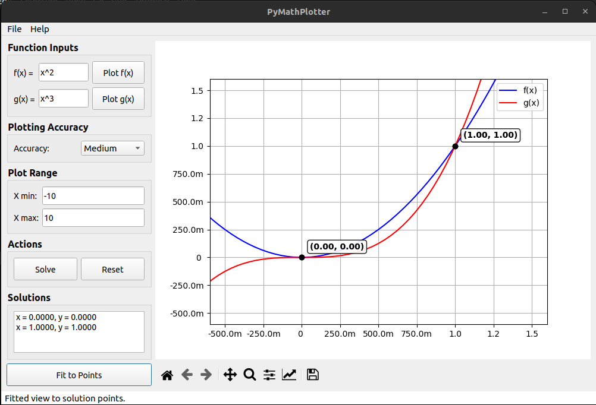
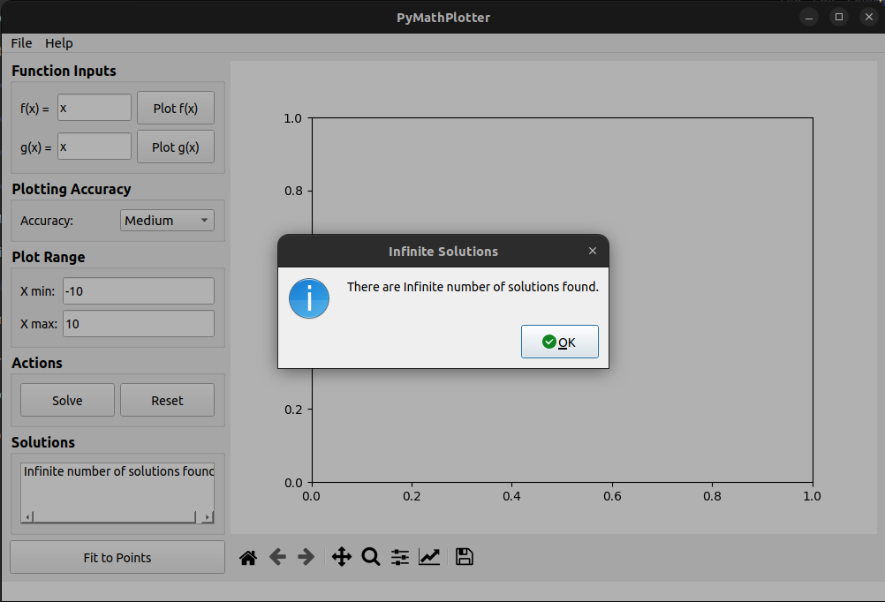
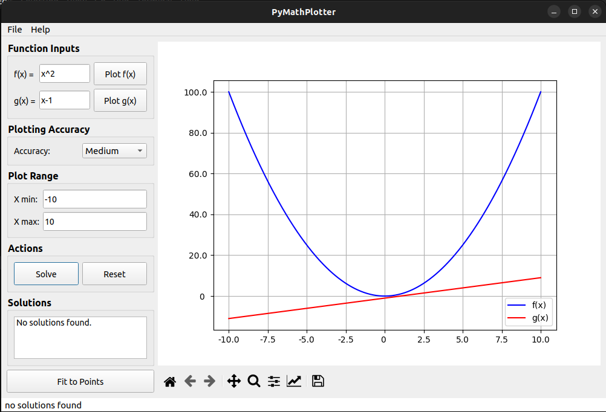
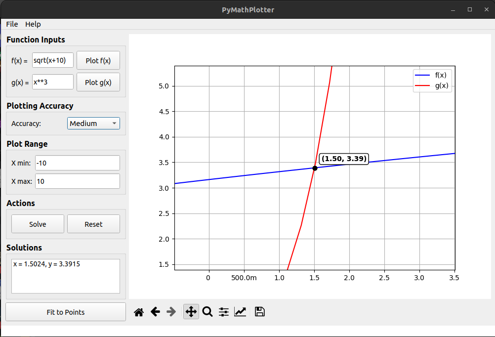
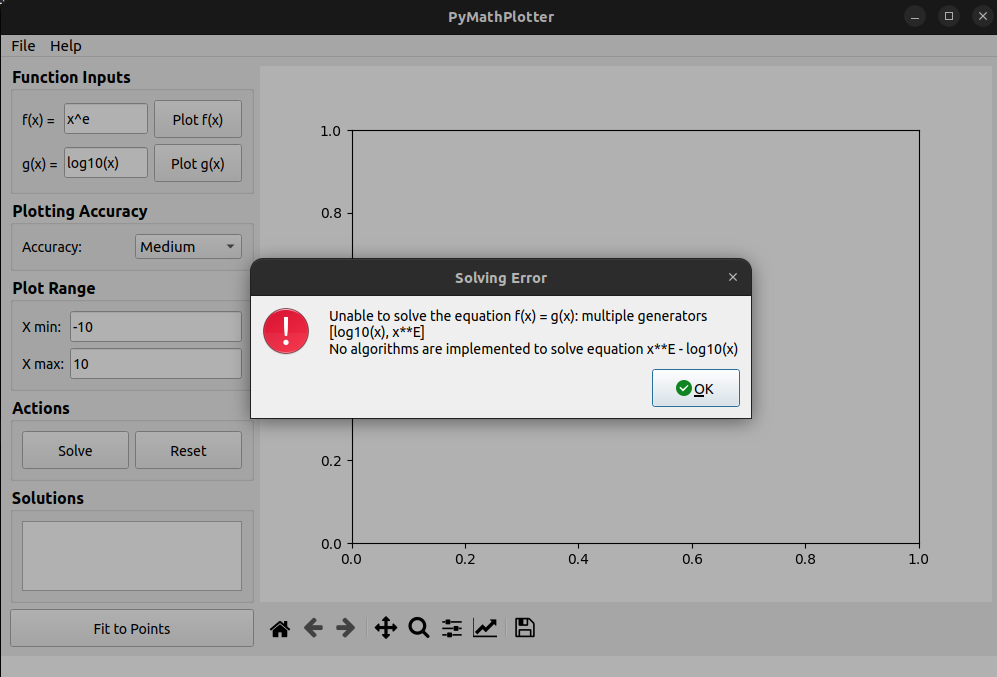

# Examples

### 1. Working Example

- **Description**: This image shows a working example of the PyMathPlot application.
- **Features Demonstrated**:
  - Basic plotting of functions.
  - Correct identification and display of intersection points.

### 2. Identical Functions

- **Description**: This image shows the plot of two identical functions, resulting in an infinite number of solutions.
- **Features Demonstrated**:
  - Plotting of identical functions.
  - Infinite intersection points due to identical functions.

### 3. No Intersections

- **Description**: This image shows the plot of two functions, f(x) = x^2 and g(x) = x - 1, which do not intersect.
- **Features Demonstrated**:
  - Plotting of functions with no intersection points.
  - Correct handling of cases with no intersections.

### 4. Long Time Example

- **Description**: This image shows the plot of two functions, f(x) = sqrt(x + 10) and g(x) = x^3, which takes a long time to compute.
- **Disadvantages**:
  - The computation time is currently long for these functions.
  - This issue will be addressed and optimized in future updates.

### 5. Cannot Solve

- **Description**: This image shows the plot of two functions, f(x) = x^2 and g(x) = log10(x), which cannot be solved symbolically and should be solved numerically.
- **Disadvantages**:
  - The current implementation cannot solve these functions symbolically.
  - Numerical solutions will be implemented in future updates.