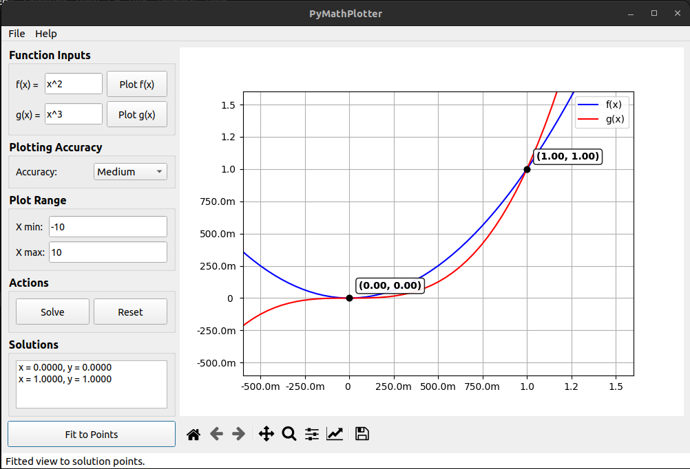

# PyMathPlot

PyMathPlot is a Python application for plotting mathematical functions and finding their intersections. It provides a graphical user interface (GUI) built with PySide2 and uses SymPy for symbolic mathematics and Matplotlib for plotting.

## Features

- Plot mathematical functions f(x) and g(x)
- Find and display intersection points of f(x) and g(x)
- Fit the plot view to the intersection points
- Save the plot as an image file

## Installation

1. Clone the repository:
    ```sh
    git clone https://github.com/ahmadel1/pymathplot.git
    cd pymathplot
    ```

2. Create a virtual environment and activate it:
    ```sh
    python -m venv venv
    source venv/bin/activate  # On Windows use `venv\Scripts\activate`
    ```

3. Install the required dependencies:
    ```sh
    pip install -r requirements.txt
    ```

## Usage

1. Run the application:
    ```sh
    python main.py
    ```

2. Use the GUI to input functions, set the plot range, and perform actions such as plotting functions, finding intersections, and saving the plot.

## Screenshot



## Project Structure

- `main.py`: Entry point of the application.
- `src/`: Contains the source code.
  - `model.py`: Defines the `FunctionModel` class for mathematical operations.
  - `view.py`: Defines the `MainWindow` class for the GUI.
  - `controller.py`: Defines the `MainController` class for handling interactions between the model and the view.
- `tests/`: Contains unit tests for the application.
- `requirements.txt`: Lists the dependencies required for the project.
- `README.md`: Project documentation.

## Running Tests

To run the tests, use the following command:
```sh
pytest